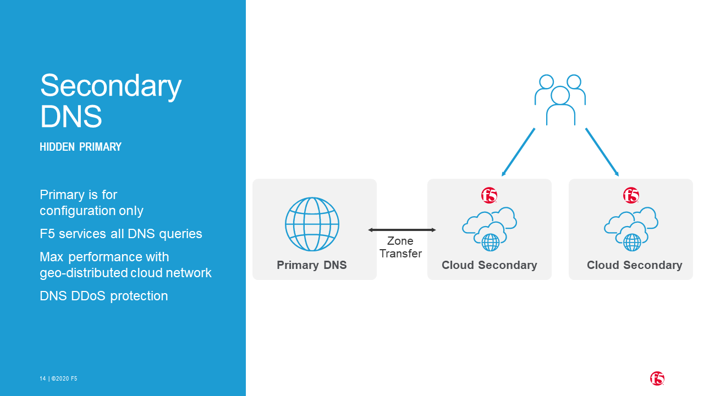

Publish your DNS zones on F5 SaaS
=======================================================================
.. contents:: Table of Contents

Introduction
==================================================
Use Case
###############
- **Security** -- Make your DNS Service Highly Available and protected from massive DDoS attack
- **Scalability** -- Delegate infrastructure management, multi-region presence and auto-scaling
- **Latency** -- Bring DNS service closest to your customers
- **Automation** -- Automate use cases:

A) **Deploy a DNS Zone** -- Publish a new DNS zone on SaaS DNS authoritative servers
B) **Update a DNS record** -- Update DNS records on a zone and then publish it

Benefit
###############
- **Security and Scalability** -- Satisfy User Experience with a DNS service uptime `SLA: 99.9% <https://www.f5.com/pdf/customer-support/eusa-sla.pdf>`_
- **Latency** -- Improve User Experience by reducing delay of DNS resolution.
- **Automation** -- Integrate easily wide DNS publication in your Infra as Code playbook
- **Cost** -- In a Hidden Master architecture, you can keep your existing DDI (DNS DHCP IPAM) solution, sized to do only management but no more DNS resolution, because all DNS request are responded by F5 DNS

Architecture
###############

Control Plane
*********************
- **Automation tool** -- Launch Dynamic DNS record update on Hidden DNS Master and then notify F5 to publish the updated zone
- **Hidden DNS Master** -- Manage and store DNS Zones
- **SaaS DNS** -- The notification (API call) initiates a zone transfer request from F5 to the authoritative DNS server that hosts the zone. The server responds with a zone transfer and the zone is loaded into the F5 DNS engine.

Same workflow as `the example of loading a zone into DNS Express <https://techdocs.f5.com/en-us/bigip-15-1-0/big-ip-dns-services-implementations/configuring-dns-express.html>`_

Data Plane
*********************
- **SaaS DNS** -- When the User's Local DNS sends a query for the zone, F5 DNS answers the query faster than the authoritative DNS server.

Same workflow as `the example of DNS Express answering DNS queries <https://techdocs.f5.com/en-us/bigip-15-1-0/big-ip-dns-services-implementations/configuring-dns-express.html>`_

Product
*********************
Products used for this demo:

- **SaaS DNS**: `F5 Cloud Services <https://simulator.f5.com/>`_
- **Hidden DNS Master**: Bind
- **Automation tool**: Ansible Tower

Demo
###############
A) Update a DNS record
*********************

.. raw:: html

    

Pre-requisites
==============
Ansible Tower
##############
virtualenv
***************************
- Create a virtualenv following `this guide <https://docs.ansible.com/ansible-tower/latest/html/upgrade-migration-guide/virtualenv.html>`_
- In virtualenv, as a prerequisite for Azure collection, install Azure SDK following `this guide <https://github.com/ansible-collections/azure>`_
- In virtualenv, install libraries:

.. code:: bash

    $ pip install netaddr dnspython

Role
***************************
Clone role `Bind <https://github.com/bertvv/ansible-role-bind>`_ in `/etc/ansible/roles/`

Credential
***************************
- Create a Service Principal on Azure following `this guide <https://docs.microsoft.com/en-us/azure/active-directory/develop/quickstart-register-app>`_
- Create a Microsoft Azure Resource Manager following `this guide <https://docs.ansible.com/ansible-tower/latest/html/userguide/credentials.html#microsoft-azure-resource-manager>`_
- Create Credentials ``cred_jumphost`` for Jumphost tasks following `this guide <https://docs.ansible.com/ansible-tower/latest/html/userguide/credentials.html#machine>`_

=====================================================   =============================================   =============================================   =============================================   =============================================
REDENTIAL TYPE                                          USERNAME                                        SSH PRIVATE KEY                                 SIGNED SSH CERTIFICATE                          PRIVILEGE ESCALATION METHOD
=====================================================   =============================================   =============================================   =============================================   =============================================
``Machine``                                             ``my_VM_admin_user``                            ``my_VM_admin_user_key``                        ``my_VM_admin_user_CRT``                        ``sudo``
=====================================================   =============================================   =============================================   =============================================   =============================================

Ansible role structure
######################
- Deployment is based on ``workflow template``. Example: ``workflow template`` = ``wf-create_create_edge_security_inbound``
- ``workflow template`` includes multiple ``job template``. Example: ``job template`` = ``poc-azure_create_hub_edge_security_inbound``
- ``job template`` have an associated ``playbook``. Example: ``playbook`` = ``playbooks/poc-azure.yaml``
- ``playbook`` launch a ``play`` in a ``role``. Example: ``role`` = ``poc-azure``

.. code:: yaml

    - hosts: localhost
      gather_facts: no
      roles:
        - role: poc-azure

- ``play`` is an ``extra variable`` named ``activity`` and set in each ``job template``. Example: ``create_hub_edge_security_inbound``
- The specified ``play`` (or ``activity``) is launched by the ``main.yaml`` task located in the role ``tasks/main.yaml``

.. code:: yaml

    - name: Run specified activity
      include_tasks: "{{ activity }}.yaml"
      when: activity is defined

- The specified ``play`` contains ``tasks`` to execute. Example: play=``create_hub_edge_security_inbound.yaml``

0) Deploy DNS infrastructure and create a Zone
==================================================
Workflow
###############################
Create and launch a workflow template ``wf-dns-create-infra`` that includes those Job templates in this order:

=============================================================   =============================================       =============================================   =============================================   =============================================   =============================================   =============================================
Job template                                                    objective                                           playbook                                        activity                                        inventory                                       limit                                           credential
=============================================================   =============================================       =============================================   =============================================   =============================================   =============================================   =============================================
``poc-azure-create_infra_dns``                                  Create Ressource Group and vNet                     ``playbooks/poc-azure.yaml``                    ``create_infra_dns``                                                                                                                            ``my_azure_credential``
``poc-azure_create-vm-jumphost``                                Create Jumphost                                     ``playbooks/poc-azure.yaml``                    ``create-vm-jumphost``                                                                                                                          ``my_azure_credential``
``poc-azure_get-vm-jumphost``                                   Get FQDN jumphost info                              ``playbooks/poc-azure.yaml``                    ``get-vm-jumphost``                                                                                                                             ``my_azure_credential``
``poc-dns_jumphost_install``                                    Install and configure Bind named server             ``playbooks/poc-dns_jumphost_install.yaml``                                                     localhost                                                                                       ``cred_jumphost``
``poc-dns-cs_create_dns_secondary``                             Create zone on F5 CS                                ``playbooks/poc-dns.yaml``                      ``cs_create_dns_secondary``                     localhost
=============================================================   =============================================       =============================================   =============================================   =============================================   =============================================   =============================================

==============================================  =============================================   ================================================================================================================================================================================================================
Extra variable                                  Description                                     Example
==============================================  =============================================   ================================================================================================================================================================================================================
``extra_platform_name``                         name used for resource group, vNet...           ``csdnsdemo``
``extra_location``                              Azure region                                    ``eastus2``
``extra_platform_tags``                         Object tags                                     ``environment=DMO project=CloudBuilderf5``
``extra_vnet_address_prefixes``                 vNet CIDR                                       ``10.15.0.0/16``
``extra_management_subnet_address_prefix``      Management subnet that hosts juphost            ``10.15.0.0/24``
``extra_admin_username``                        Admin user of jumphost                          ``PawnedAdmin``
``extra_cmp_ip``                                IP address of Ansible Tower                     ``1.1.1.1/32``
``extra_dns_record_zone``                       DNS zone                                        ``acme.dev``
``extra_jumphost``                              properties of jumphost                          dict, see below
``extra_cs``                                    F5 Cloud Services credentials                   dict, see below
==============================================  =============================================   ================================================================================================================================================================================================================

.. code:: yaml

    extra_jumphost:
      name: jumphost
      vm_size: Standard_DS1_v2
      private_ip: 10.15.0.10
      acl_src_ips:
        - '10.0.0.0/8'
      ssh_crt: "-----BEGIN CERTIFICATE-----...-----END CERTIFICATE-----"

.. code:: yaml

    extra_cs:
      username: name@acme.com
      password: ...
      hostname: api.cloudservices.f5.com
      api_version: v1

Registrar
###############################
Specify F5 CS as Name Servers for your DNS zone. Use Name Servers described `here <https://clouddocs.f5.com/cloud-services/latest/f5-cloud-services-DNS-FAQ.html#q-how-would-i-perform-dns-queries-for-the-zone-i-am-configuring-in-f5-cloud-services-are-the-name-servers-documented-publicly>`_

A) Update Zone
==================================================
Workflow
###############################
Create and launch a workflow template ``wf-dns-update_record`` that includes those Job templates in this order:

=============================================================   =============================================       =============================================   =============================================   =============================================   =============================================   =============================================
Job template                                                    objective                                           playbook                                        activity                                        inventory                                       limit                                           credential
=============================================================   =============================================       =============================================   =============================================   =============================================   =============================================   =============================================
``poc-azure_get-vm-jumphost``                                   Get FQDN jumphost info                              ``playbooks/poc-azure.yaml``                    ``get-vm-jumphost``                                                                                                                             ``my_azure_credential``
``poc-dns-cs_update_dns_secondary``                             Update zone on Bind and then notify F5 CS           ``playbooks/poc-dns.yaml``                      ``cs_update_dns_secondary``                     localhost
=============================================================   =============================================       =============================================   =============================================   =============================================   =============================================   =============================================

==============================================  =============================================   ================================================================================================================================================================================================================
Extra variable                                  Description                                     Example
==============================================  =============================================   ================================================================================================================================================================================================================
``extra_platform_name``                         name used for resource group, vNet...           ``csdnsdemo``
``extra_dns_record_zone``                       DNS zone / DNS domain                           Survey. Example:``acme.dev``
``extra_dns_record_name``                       DNS record name / hostname                      Survey. Example:``kibana``
``extra_dns_record_type``                       DNS record type                                 Survey. Example:``[A, CNAME, MX, SRV, TXT]``
``extra_dns_record_value``                      DNS record value                                Survey. Example:``2.2.2.2``
``extra_jumphost``                              properties of jumphost                          dict, see below
``extra_cs``                                    F5 Cloud Services credentials                   dict, see below
==============================================  =============================================   ================================================================================================================================================================================================================

.. code:: yaml

    extra_jumphost:
      name: jumphost

.. code:: yaml

    extra_cs:
      username: name@acme.com
      password: ...
      hostname: api.cloudservices.f5.com
      api_version: v1

Troubleshoot
==================================================
Test DNS resolution:

:kbd:`dig acme.dev +trace`

Test Dynamic DNS update locally:

.. code:: bash

    echo "server 127.0.0.1
    update add kibana.acme.dev 3600 IN A 10.15.0.100
    send
    quit
    " | nsupdate

After a reboot, Bind cannot create file on Linux system. Disable SElinux:

:kbd:`setenforce 0`

Check named configuration:

:kbd:`named-checkconf /etc/named.conf`

Check zone configuration:

:kbd:`named-checkzone acme.dev /var/named/zone.acme.dev`

Reference
==================================================
- `F5 SaaS Simulator <https://simulator.f5.com/>`_
- `F5 SaaS Portal <https://portal.cloudservices.f5.com/console>`_
- `F5 SaaS Documentation <https://clouddocs.f5.com/cloud-services/latest/>`_
- `F5 SaaS KPI <https://status.cloudservices.f5.com/>`_
